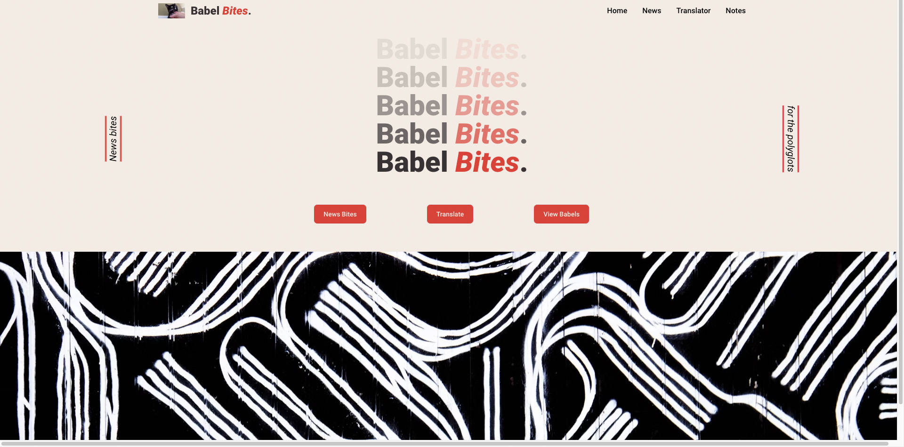
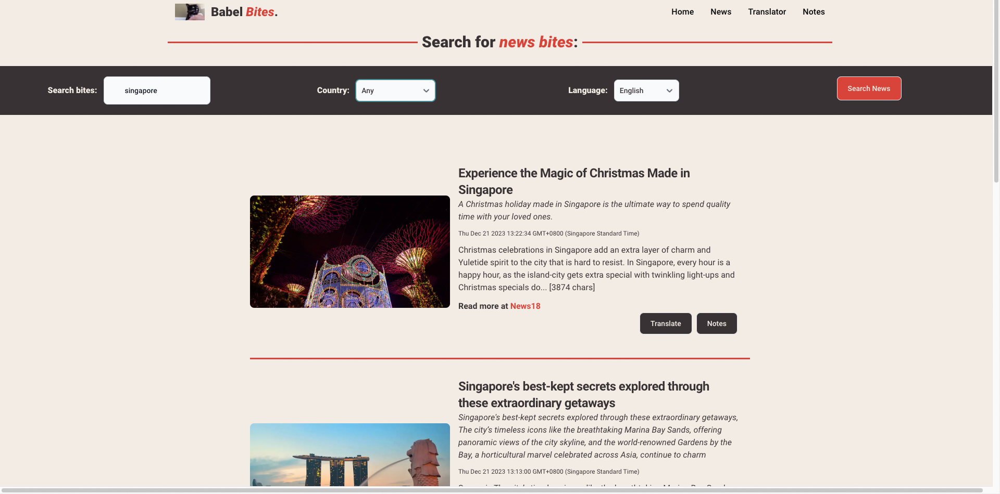
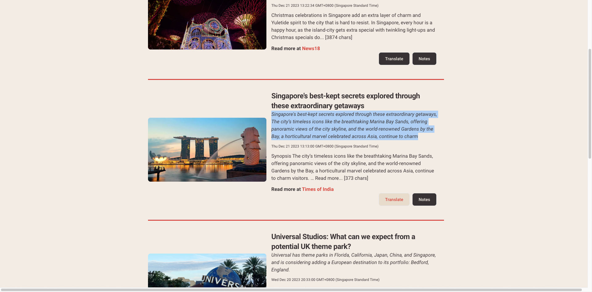
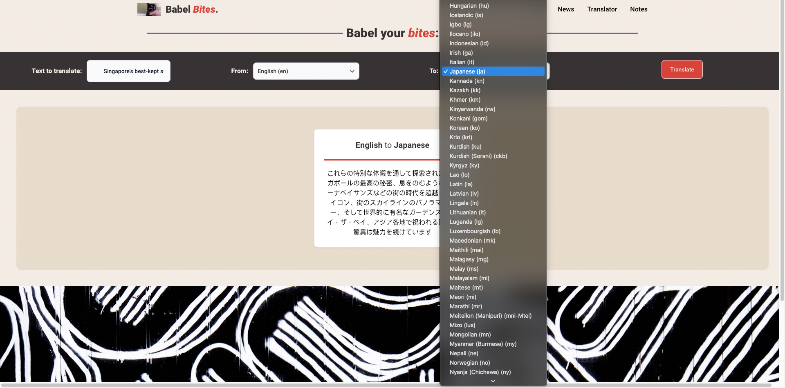
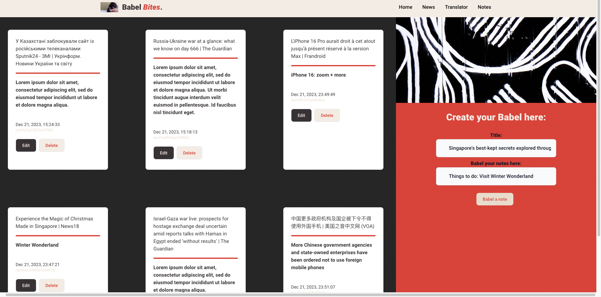
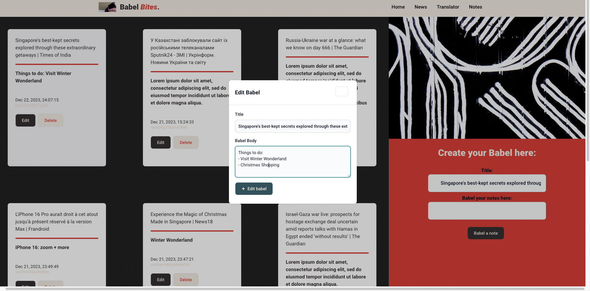

# Babel Bites

An application for bite-size news and a text translator for aspiring polyglots.

## Features

- Filter for news from 30 countries and 22 languages
- Highlight words or phrases from news to translate into various languages or write your own notes
- Translator page allows translation to 100+ languages
- Notes page to post notes about the corresponding headlines
- Edit or delete your notes

## Wireframe

### Pages

**Homepage**:

**News Page**:

- Search for news of your topic of interest filtered by country or language
- Highlight word or phrases to Translate
- Post a note on the headline of interest

**Translation Page**:

- input your own word > select language
- receives selected word or phrases from News Page to translate

**Notes Page:**

- create your own notes
- receives selected headline from News Page for you to make your own commentary

## Icebox

- Search bar on Notes Pages to find notes
- Sort notes by date - they seem to be randomly rendering?
- Notes formatting - Airtable limitation?
- Responsive design for smaller devices

---

### Project Criteria

Use React framework to build your application with at least:

- [x] 5 components
- [x] 4 props
- [x] 2 useStates
- [x] 2 react router routes
- [x] 1 lifting state, which is used to implement CRUD on the client side
